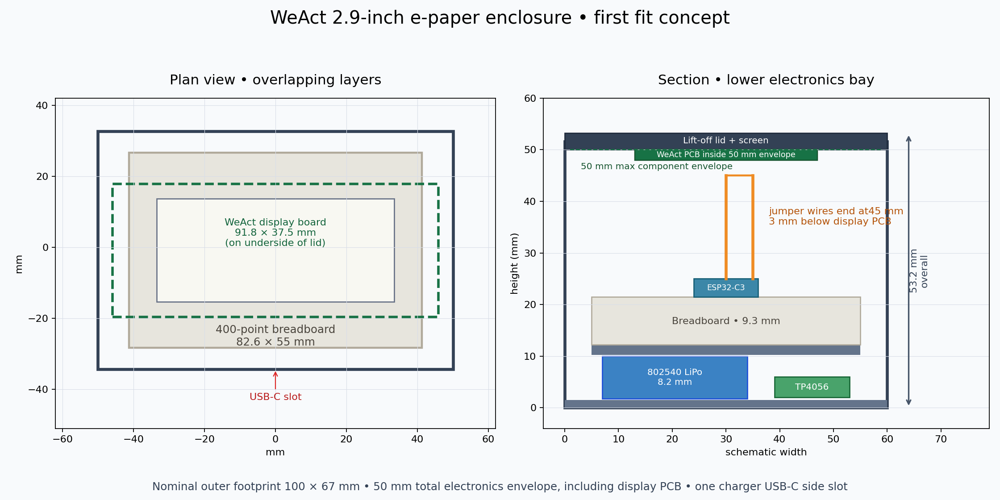
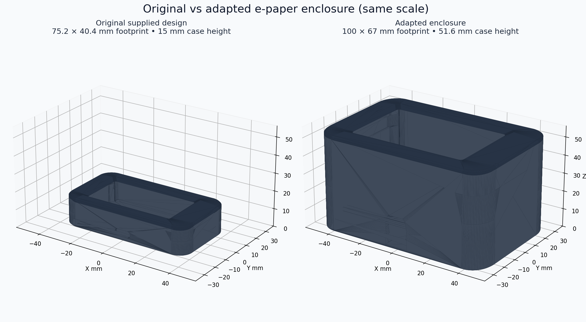

# CAD Projects

3D-printable enclosures and organizers, modeled in Python with [build123d](https://github.com/gumyr/build123d). Each part is a script. Change the dimensions at the top of a script, run it, and you get an STL ready for your slicer.

## Projects

### E-ink weather station case

A case and lift-off lid for an ESP32 weather station with a WeAct 2.9-inch e-paper display, a half-size breadboard, an 802540 LiPo battery, and a TP4056 USB-C charger. It is made by resizing an existing "ESP32 + ePaper-Display" case, adding breadboard support rails, and cutting a USB-C charging opening.



*Plan and section views showing how the display, breadboard, battery, and charger fit inside.*



*The original case next to the resized version.*

Dimensions, fit notes, and build steps are in [`e-ink-weather-station-case/README.md`](e-ink-weather-station-case/README.md).

### Mahjong tile case

A storage set for mahjong tiles, made of three parametric parts:

| Script | Part | Size (mm) |
| --- | --- | --- |
| `tile_tray.py` | Open-top tile tray, 3 mm walls | 180 × 109 × 17.5 |
| `crate.py` | Open-top crate that holds 4 trays (2 side by side, 2 stacked), 1.5 mm clearance per side | 193 × 231 × 43 |
| `lid.py` | Flat lid for the crate | 193 × 231 × 3 |

The tray dimensions are repeated in `crate.py` and `lid.py`. If you change the tray size, update all three scripts.

## Repository layout

```
.
├── e-ink-weather-station-case/
│   ├── Build123d_Enclosure.py     # generator script
│   ├── build123d_sources/         # original STLs used as input
│   ├── build123d_generated/       # generated case and lid STLs
│   └── *.png                      # preview images
├── mahjong-case/
│   ├── tile_tray.py
│   ├── crate.py
│   └── lid.py
├── tray.stl                       # output of tile_tray.py
└── tray_holder.stl                # output of crate.py
```

## Getting started

You need Python 3.10 or newer.

```sh
python3 -m venv venv
source venv/bin/activate
pip install build123d ocp_vscode
```

Then run a script from its own folder:

```sh
cd e-ink-weather-station-case
python Build123d_Enclosure.py      # writes to build123d_generated/

cd ../mahjong-case
python crate.py                    # writes ../tray_holder.stl
```

The mahjong scripts call `show()` from [`ocp_vscode`](https://github.com/bernhard-42/vscode-ocp-cad-viewer) to preview the part in the OCP CAD Viewer in VS Code. The STL is exported either way. Where each script writes depends on the folder you run it from: `tile_tray.py` writes `tray.stl` to the current folder, and `crate.py` and `lid.py` write to the parent folder.

## Printing tips

- All dimensions are in millimeters.
- Measure your actual components before a final print. Breadboards, charger boards, and tiles vary between manufacturers.
- For big parts like the mahjong crate, print a small test section first to check the clearances.
